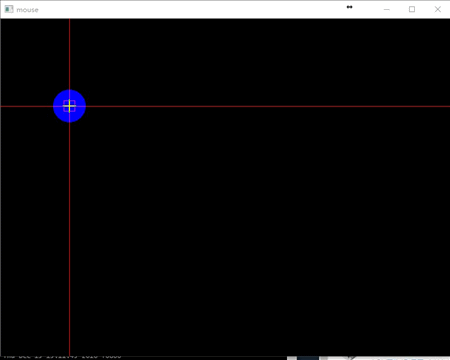

# higui组件及绘图

## main.cpp运行效果



## 鼠标操作

注册鼠标事件回调函数  
`void setMouseCallback(const String& winname, MouseCallback onMouse, void* userdata = 0);`  
第一个参数：winname, 指定哪一个窗口（nameWindow创建的窗口名字符串）；  
第二个参数：onMouse，`void (*MouseCallback)(int event, int x, int y, int flags, void* userdata);`类型的函数指针
>其中event表示事件类型， 常用的有EVENT_MOUSEMOVE，EVENT_LBUTTONDOWN,EVENT_LBUTTONUP等等  
>x,y分别表示鼠标的坐标，  
>flags是EVENT_FLAG的组合
>userdata表示用户自定义数据

第三个参数：userdata，表示传递给回调函数的自定义参数，一般设置为0

## 滑动条

```C++
int createTrackbar(const String& trackbarname, const String& winname,
                              int* value, int count,
                              TrackbarCallback onChange = 0,
                              void* userdata = 0);
```

第一个参数：trackbarname，滑动条名字，字符串；  
第二个参数：winname,窗口名字；  
第三个参数：value指针，表示滑块位置的地址；  
第四个参数：count, 滑动条的最大值；  
第五个参数：onChange,`void (*TrackbarCallback)(int pos, void* userdata);`类型的函数指针；  
第六个参数：userdata,自定义用户参数；

此外还有`int getTrackbarPos(const String& trackbarname, const String& winname);`函数用以获得滑块的当前位置。

## 绘图

### 画线

```C++
void line(InputOutputArray img, Point pt1, Point pt2, const Scalar& color,
                     int thickness = 1, int lineType = LINE_8, int shift = 0);
```

第一个参数：img, 画布，一般为mat类型的图像；  
第二个参数：pt1，起始点，Point(20, 20)；  
第三个参数：pt2，终点；  
第四个参数：color，颜色, Scalar(B, G, R)；
第五个参数：thickness，线宽；  
第六个参数：lineType，线类型，默认是8联通；  
第七个参数：shift， Number of fractional bits in the point coordinates

### 画矩形

```C++
void rectangle(InputOutputArray img, Point pt1, Point pt2,
                          const Scalar& color, int thickness = 1,
                          int lineType = LINE_8, int shift = 0);

void rectangle(CV_IN_OUT Mat& img, Rect rec,
                          const Scalar& color, int thickness = 1,
                          int lineType = LINE_8, int shift = 0);
```

### 画椭圆

```C++
void ellipse(InputOutputArray img, Point center, Size axes,
                        double angle, double startAngle, double endAngle,
                        const Scalar& color, int thickness = 1,
                        int lineType = LINE_8, int shift = 0);
```

第一个参数：img, 画布；  
第二个参数：center, 椭圆中心点;
第三个参数：axes, 大小；  
第四个参数：angle, 旋转角度；
第五个参数：startAngle，起始角度；  
第六个参数：endAngle， 终止角度；  
第七个参数：color， 颜色；  
第八个参数：thickness， 线宽，*-1表示是实心圆*；  
……

例如， ellipse.cpp运行的效果如图  


### 画圆

```C++
void circle(InputOutputArray img, Point center, int radius,
                       const Scalar& color, int thickness = 1,
                       int lineType = LINE_8, int shift = 0);
```

第一个参数：img，画布；  
第二个参数：center， 圆心；  
第三个参数：radius， 半径；  
第四个参数：color， 颜色；  
第五个参数：thickness， 线宽，*-1表示画实心圆*；  
第六个参数：lineType， 线型；  

### 画多边形

```C++
void fillPoly(Mat& img, const Point** pts,
                         const int* npts, int ncontours,
                         const Scalar& color, int lineType = LINE_8, int shift = 0,
                         Point offset = Point() );
```

第一个参数：img, 画布；  
第二个参数：pts, 顶点集；  
第三个参数：npts, 顶点数；  
第四个参数：ncontours, 多边形数目；  
第五个参数：color，颜色；  

例，fillPoly.cpp运行结果如下图，


### 写文字

```C++
void putText( InputOutputArray img, const String& text, Point org,
                         int fontFace, double fontScale, Scalar color,
                         int thickness = 1, int lineType = LINE_8,
                         bool bottomLeftOrigin = false );
```

第一个参数：img, 画布；  
第二个参数：text, 要写的文字；  
第三个参数：org, 要写的位置；  
第四个参数：fontFace, 字体；  
第五个参数： fontscale, 字体大小；  
第六个参数： color， 字体颜色；  
第七个参数： thickness，字体粗细，不能为负数；  
