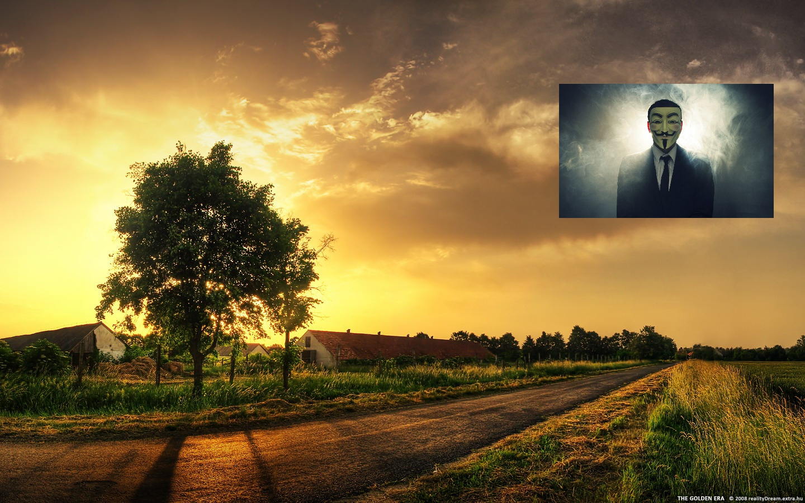

# opencv ROI和图像混合
效果图如下  

## 设置ROI
`Mat imageROI = srcImg1(Rect(1000, 150, srcImg2z.cols, srcImg2z.rows));`
## opencv改变图片大小的方法
图中背景图片（srcImg1）的大小是1440\*900，前景图片（srcImg2）的大小是1920*1200,因此需要调整图像尺寸才能进行图像混合
```
Size sz(srcImg2.cols/5, srcImg2.rows/5);
Mat srcImg2z;
resize(srcImg2, srcImg2z, sz);
```
resize函数的函数原型  
>`void resize( InputArray src, OutputArray dst,
                          Size dsize, double fx = 0, double fy = 0,
                          int interpolation = INTER_LINEAR );`  

在python中，图片被当做矩阵来处理/r
处理矩阵会使用numpy中的各种方法

