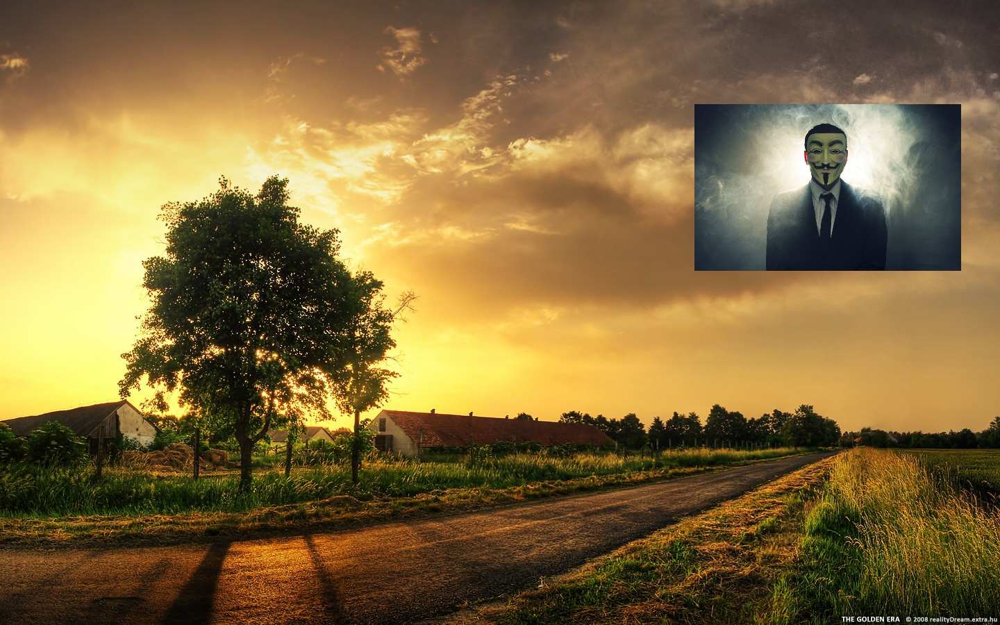

# opencv ROI和图像混合
效果图如下  

## 设置ROI

## opencv改变图片大小的方法
图中背景图片（srcImg1）的大小是1440\*900，前景图片（srcImg2）的大小是1920*1200,因此需要调整图像尺寸才能进行图像混合
```
Size sz(srcImg2.cols/5, srcImg2.rows/5);
Mat srcImg2z;
resize(srcImg2, srcImg2z, sz);
```
resize函数的函数原型  
>`void resize( InputArray src, OutputArray dst,
                          Size dsize, double fx = 0, double fy = 0,
                          int interpolation = INTER_LINEAR );`  
>其中,src 为原图像，dst为输出图像，dsize是要resize到的图像大小，后边的fx和fy也是指定resize的大小的，因此dsize和fx,fy不能同时为零，也就是说要么dsize不为零而fx与fy同时可以为0，要么dsize为0而fx与fy不同时为0；resize函数的目标大小可以是任意的大小，可以不保持长宽比率，删除的像素或者新增的像素值通过interpolation控制；当同时指定dsize和fx,fy时，dsize享有更高的优先级。
